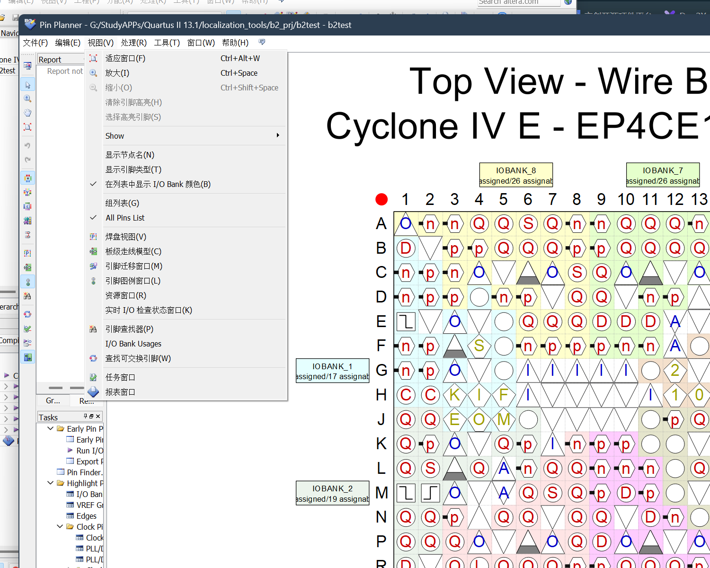
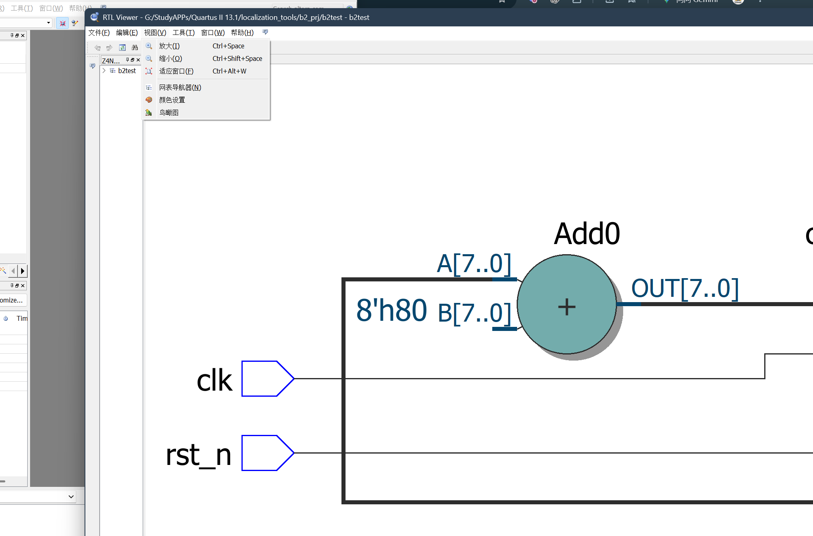

# Quartus II 13.1 简体中文汉化包

> **Quartus II 13.1 (64-bit) 汉化补丁 / Chinese (Simplified) localization patch**
> 覆盖主窗口、Pin Planner（引脚规划器）、RTL Viewer（RTL 查看器）的全部菜单，随装随用、可完整卸载。





## 简介

本项目通过对 Quartus II 13.1 三个 UI 模块 DLL 的二进制级修改实现简体中文界面：

| 模块 | 修改内容 |
|---|---|
| `sys_qui.dll` | 主窗口菜单词条 + UTF-8 编解码支持 |
| `gcl_afcq.dll` | 主窗口 / Pin Planner / RTL Viewer 共享菜单词条 |
| `saui_aseq.dll` | Information Bar（信息栏） |

共 **198 条**菜单/界面词条，原理是在 DLL 内追加 `.zhcn` 自定义节存放 UTF-8 文本池，
并把原英文字符串的引用重定向到中文文本；不修改 Quartus 的任何其他文件，
所有原始 DLL 安装时自动备份，卸载时逐字节还原。

## 环境要求

- **Quartus II 13.1（64 位）**（针对未修改的原版 13.1 制作；若 DLL 曾被其他补丁改动过，
  建议先还原，安装器会自动备份当前文件、卸载时原样恢复）
- Windows 系统；安装/卸载前**必须关闭 Quartus**
- 对 Quartus 安装目录的写入权限（装在 `C:\altera` 等位置时可能需要管理员权限运行）

## 安装

1. 下载本仓库（Code → Download ZIP，或 `git clone`）并解压到**任意位置**；
2. 关闭 Quartus；
3. 双击 **`安装.bat`**。

脚本会自动定位 Quartus 安装目录（也支持手动指定）：

```powershell
powershell -NoProfile -ExecutionPolicy Bypass -File .\install.ps1 -QuartusBin64 "C:\altera\13.1\quartus\bin64"
```

安装完成后启动 Quartus 即可看到中文菜单。

## 卸载

关闭 Quartus，双击 **`卸载.bat`** 即可逐字节还原英文原版，并自动清理备份目录。

## 翻译范围与已知限制

**已翻译**：主窗口 9 个菜单、Pin Planner 7 个菜单、RTL Viewer 6 个菜单中的全部固定文本
（含缩放、Assign 系列、Live I/O Check、窗口管理等 32 条动态视图词条），以及信息栏标题。

**不翻译 / 无法翻译**（设计边界，非缺陷）：

- 窗口标题栏、动态路径、工程名（避免误伤任意文本）；
- `撤销/重做` 等由 Qt 框架提供的标准 QAction 文本（随 Qt 语言包显示，非本包来源）；
- 走 `QObject::tr()` 翻译路径的少量字符串（不受本方案控制）；
- 部分英文项本就不在以上三个窗口的菜单内（如 `Show ▸`、`All Pins List`）。

## 实现原理（一句话版）

Quartus 的 Qt 4 界面用 `codecForCStrings` 把 C 字符串转 `QString`——补丁在进程初始化处
注入 UTF-8 编解码设置，再把译文写入 DLL 新增的 `.zhcn` 节（自定义 QCN1 文本池，
带 DIR64 重定位），并将原英文串的全部代码/数据引用改指向中文文本。

## 文档

- [docs/translations.csv](docs/translations.csv) —— 全部 **198 条**词条的
  原文 / 译文对照表（`file, kind, original, translation, rva`；kind =
  `pool` 词条池 / `in_place` 原位覆写），可由
  [tools/extract_translations.py](tools/extract_translations.py) 从成品二进制反提取复现
- [docs/zhcn-format.md](docs/zhcn-format.md) —— `.zhcn` 节 / QCN1 文本池格式规格
  与三类修改（池重定向、原位覆写、编解码注入）的落盘方式

## 声明

本项目仅供个人学习交流使用，请支持正版。Quartus、Altera 及相关标识为
Altera / Intel 公司的商标，本项目与其无任何隶属关系。
使用风险自负：安装器虽做了逐字节备份与校验，仍建议重要工程先行保存。
